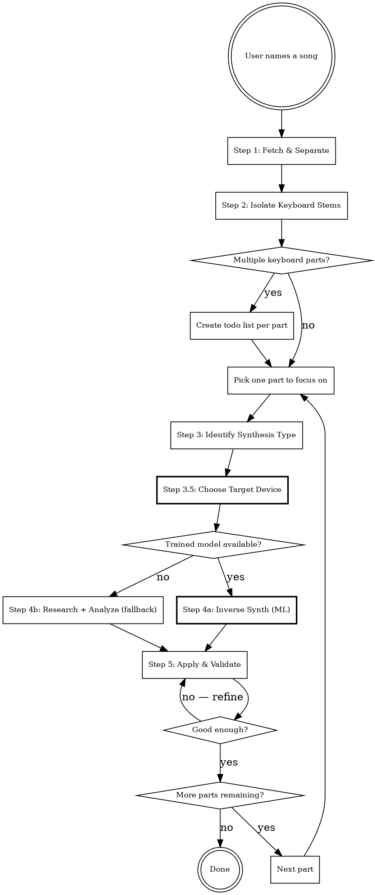

# Recreate the Sound of a Song

## Overview

Reverse-engineer the keyboard sounds used in a specific song and apply them to the user's hardware. Uses the audio-analysis-mcp server for stem separation, spectral analysis, and ML-based inverse synthesis to predict synth parameters directly from audio.

## When to Use

- User wants to play a specific song and needs the right sound
- User asks "what sound/patch was used in [song]?"
- User wants to match a keyboard tone from a recording

## When NOT to Use

- User already knows the patch and just wants to load it
- User is asking about non-keyboard instruments
- User wants a generic genre sound (e.g. "give me a jazz organ") rather than a specific song's sound

## Workflow



## Step 1: Fetch & Separate Stems

Use audio-analysis-mcp to get the audio and separate it into stems.

```
1. fetch_audio(source="<YouTube URL or local path>")    → full_mix.wav
2. stem_separate(audio_path=full_mix.wav)                → vocals.wav, drums.wav, bass.wav, other.wav
```

The **"other"** stem contains keyboards, synths, pads, and any non-vocal/drum/bass instruments.

**If the user provides a YouTube URL or file path**, use it directly. Otherwise, search for the song on YouTube and confirm the URL with the user before fetching.

**Stem separation takes 1-5 minutes** — inform the user it's running.

## Step 2: Focus on Keyboard Parts

Listen to the "other" stem via `spectrum_analyze` to understand what keyboard parts are present.

```
spectrum_analyze(audio_path=other.wav, start_time=0, duration=10)
```

**Critical rule: One sound at a time.** A single song may use multiple keyboard parts with different timbres (piano riff, organ pads, synth lead, string pad). Never attempt to recreate multiple parts simultaneously.

- Use `spectrum_analyze` at different timestamps to identify distinct keyboard sections
- If multiple keyboard parts exist, create a todo list and let the user choose which to tackle first
- Each part gets its own full analysis (steps 3-5)

## Step 3: Identify the Synthesis Type

Determine which synthesis engine produced the sound. This selects which inverse model to use.

**Two approaches in parallel:**

### 3a. Spectral fingerprinting

Use `spectrum_analyze` on the keyboard stem. The harmonic profile reveals the synthesis type:

| Spectral signature | Likely synthesis | Inverse model |
|-------------------|-----------------|---------------|
| Strong odd harmonics, spectral rolloff | Subtractive (pulse/square osc + LP filter) | `subtractive_*` |
| Complex inharmonic partials, metallic | FM synthesis | `fm_*` |
| Clean integer harmonics, drawbar-like | Additive / organ | `organ_*` |
| Realistic acoustic partials, noise transients | Sample-based | `sample_*` |
| Evolving spectrum over time | Wavetable | `wavetable_*` |

### 3b. Online research

Search for interviews, studio session notes, gear lists for the song/album. For famous songs the gear is often well-documented. This confirms or narrows the synthesis type.

**After identifying the type**, call `list_models` to check which trained inverse models are available, and pick the best match.

**Critical constraint:** Inverse models are trained per **synthesis type**, not per device. Only use `inverse_synth` when the target device's synthesis engine matches the model's type. Sample-based keyboards (e.g., Nord piano/sample engine) are NOT valid targets for `inverse_synth` — always use the fallback research workflow (Step 4b) for sample-based sounds.

## Step 3.5: Choose Target Device

Before designing or predicting parameters, determine which connected device is the best fit for the identified sound. This step is critical when the MCP is connected to multiple devices.

### Device selection process

1. **Query the device pool** — call `is_connected` to list all connected devices with their indices.
2. **Get each device's capabilities** — call `get_system_prompt(device=N)` and `list_parameters(device=N)` for each connected device. The system prompt describes the device's synthesis engine, signal path, and sound design capabilities.
3. **Score devices against the sound requirements** using the criteria below.
4. **Select the best match** and note its device index for Steps 4 and 5.

### Scoring criteria

Evaluate each device against the requirements identified in Step 3. The criteria are ordered by importance:

| Criterion | What to check | Example |
|-----------|--------------|---------|
| **Synthesis type match** | Does the device support the required synthesis method? An additive sound needs a device with additive synthesis (e.g., organ drawbars). A subtractive sound needs oscillators + filters. | Sound needs drawbar organ → Nord (has organ engine) scores higher than Prophet-6 (subtractive only) |
| **Polyphony** | Is the sound polyphonic (chords, pads) or monophonic (bass, lead)? A monophonic device cannot reproduce a polyphonic part. | Polyphonic pad → skip monophonic devices |
| **Parameter coverage** | Does the device have the controls needed to shape this sound? Check for required oscillator types, filter types, envelope stages, modulation routing. | Sound needs PWM → device must have pulse width parameter |
| **Timbral range** | Can the device reach the target timbre? A device with only saw/square oscillators cannot produce FM bell tones. | Metallic bell → FM-capable device scores higher |
| **Effects availability** | Does the device have the effects heard in the sound (rotary speaker, chorus, specific reverb types)? | Leslie sound → device with rotary speaker effect scores higher |

### When only one device is connected

Skip this step — the single device is the target by default (backwards compatible with single-device usage).

### When no device is a good fit

If no connected device can reasonably produce the sound, tell the user:
- Which device is the closest match and what compromises are needed
- What kind of device would be ideal for this sound
- Offer to proceed with the best available option

### Multiple parts across multiple devices

When recreating a song with multiple keyboard parts (from Step 2), different parts may be assigned to different devices. Track which device is assigned to which part in the todo list. This is the primary benefit of multi-device support for sound recreation.

## Step 4a: Inverse Synth — ML-Based Parameter Prediction (Primary)

When a trained model exists for the identified synthesis type **and** the target device matches that synthesis type, use it to predict a raw parameter vector from the audio.

```
inverse_synth(
  audio_path=other.wav,       # or a trimmed section with the target sound
  synth_type="subtractive",   # matches the synthesis type, NOT a specific device
  top_k=3                     # get top 3 predictions for comparison
)
```

**Returns** a ranked list of raw parameter vectors (0.0-1.0 normalized) with confidence scores and vector labels. The model's timbre embedding is trained to see through effects, polyphony, and noise — it predicts the **dry patch parameters** regardless of what's in the mix.

**Choosing the right model:**
- Match by **synthesis type**: subtractive sound → `subtractive` model, FM sound → `fm` model, organ sound → `organ` model
- The target device (from Step 3.5) must be of the same synthesis type. If not, use Step 4b (fallback).
- **Never use `inverse_synth` for sample-based keyboards** (e.g., Nord piano/sample engine) — these don't have a synthesizable parameter space
- If `top_k > 1`, briefly describe the differences between predictions to the user

**Mapping vector to device parameters:**
This is the agent's responsibility. The vector labels (e.g., `osc1_shape`, `lp_freq`) are abstract synthesis parameter names. The agent must:
1. Call `list_parameters(device=N)` on the target device
2. Match vector labels to device parameter names by function (e.g., `lp_freq` → the device's filter cutoff parameter)
3. Scale from 0.0-1.0 to the device's parameter range
4. Skip vector entries that have no equivalent on the target device, and note the gap to the user

## Step 4b: Research + Spectral Analysis (Fallback)

When no trained model is available for the synthesis type, fall back to manual analysis.

### Online research
1. Search for the specific song's keyboard setup (interviews, forums, production breakdowns)
2. Check keyboard magazines, YouTube recreations, gear databases
3. For famous songs, exact presets and settings are often documented

**Terminology note:** Online sources use "patch", "preset", and "program" interchangeably — they all mean a stored sound configuration. In this system, stored sounds are called **programs** (`listPrograms` / `loadProgram`).

### Spectral-guided parameter estimation
Use `spectrum_analyze` output to manually map spectral features to synth parameters:
- `synth_hints` in the analysis output provides direct parameter suggestions
- Harmonic profile → oscillator type and mix
- Spectral envelope → filter cutoff and resonance
- Temporal profile → ADSR envelope settings
- Modulation detection → LFO / chorus / vibrato settings

### Wet vs dry awareness
Stems are almost always **wet** (effects from mixing). When setting parameters:
- Focus on the **attack transient** — effects have less impact on the initial strike
- The `synth_hints` from `spectrum_analyze` already account for common effects signatures
- Set the dry patch first, then add effects to taste

## Step 5: Apply to Hardware & Validate

### Apply the parameters

Use keyboards-mcp to apply the predicted (or manually designed) parameters to the target device chosen in Step 3.5:

```
# Always check available params first
list_parameters(device=1)

# Apply the predicted parameter vector to the target device
set_parameters(device=1, parameters=[
  {name: "osc1_shape", value: 127},
  {name: "lp_freq", value: 92},
  ...
])
```

**If the inverse model's target synth differs from the target device**, map parameters intelligently:
- Match by function (oscillator shape → oscillator shape, filter cutoff → filter cutoff)
- Skip parameters that don't exist on the target device
- Note any limitations to the user

### Validate with A/B comparison

If the user has audio capture set up (BlackHole or audio interface):

```
1. Send a sustained chord via keyboards-mcp
2. audio_render(duration=3, device="BlackHole")         → rendered.wav
3. audio_compare(target_path=other.wav, rendered_path=rendered.wav)
```

The comparison returns:
- **Similarity score** (0-1)
- **Frequency band diffs** with specific actions ("boost mids by 3dB", "lower filter cutoff")
- **Temporal diffs** ("attack is 40ms too slow")

Use the `action_items` to refine parameters and repeat until the similarity score is satisfactory or the user is happy.

### Without audio capture

If no audio capture is available, ask the user to play and describe what sounds off. Adjust parameters based on their feedback.

## Common Mistakes

| Mistake | Fix |
|---------|-----|
| Guessing from genre stereotypes | Research the specific song — don't assume "80s pop = DX7" |
| Trying to recreate all parts at once | One sound at a time, create todos for multiple parts |
| Using wrong inverse model | Check `list_models` and match to **synthesis type** — one model per type, not per device |
| Using inverse_synth for sample-based sounds | Nord piano/sample engine is a sampler, not a synth — use the research fallback (Step 4b) |
| Ignoring effects processing | The inverse model predicts dry params — add effects separately to match the wet stem |
| Skipping validation | Always offer A/B comparison when audio capture is available |
| Trusting a low-confidence prediction blindly | If confidence < 0.6, try `top_k=3` and compare, or fall back to Step 4b |
| Sending to wrong device | Always pass the `device` index from Step 3.5 to every MCP tool call |
| Skipping device selection | When multiple devices are connected, always run Step 3.5 — don't default to device 1 |
| Ignoring synthesis type mismatch | A subtractive synth cannot reproduce an additive organ sound well — pick the right device. inverse_synth type must match target device type. |
| Assigning polyphonic part to mono device | Check polyphony requirements against device capabilities before committing |