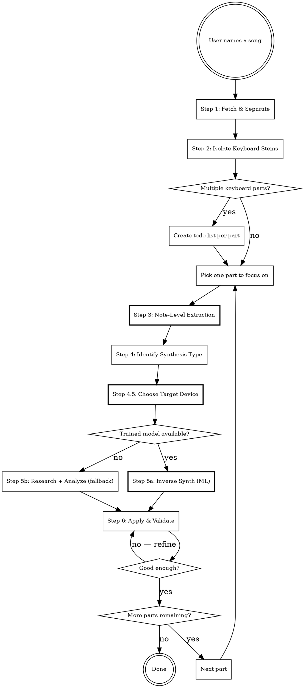

# Recreate the Sound of a Song

## Overview

Reverse-engineer the keyboard sounds used in a specific song and apply them to the user's hardware. Uses the audio-analysis-mcp server for stem separation, spectral analysis, and ML-based inverse synthesis to predict synth parameters directly from audio.

## When to Use

- User wants to play a specific song and needs the right sound
- User asks "what sound/patch was used in [song]?"
- User wants to match a keyboard tone from a recording

## When NOT to Use

- User already knows the patch and just wants to load it
- User is asking about non-keyboard instruments
- User wants a generic genre sound (e.g. "give me a jazz organ") rather than a specific song's sound

## Workflow



## Step 1: Fetch & Separate Stems

Use audio-analysis-mcp to get the audio and separate it into stems.

```
1. fetch_audio(source="<YouTube URL or local path>")    → full_mix.wav
2. stem_separate(audio_path=full_mix.wav)                → vocals.wav, drums.wav, bass.wav, other.wav
```

The **"other"** stem contains keyboards, synths, pads, and any non-vocal/drum/bass instruments.

**If the user provides a YouTube URL or file path**, use it directly. Otherwise, search for the song on YouTube and confirm the URL with the user before fetching.

**Stem separation takes 1-5 minutes** — inform the user it's running.

## Step 2: Focus on Keyboard Parts

Listen to the "other" stem via `spectrum_analyze` to understand what keyboard parts are present.

```
spectrum_analyze(audio_path=other.wav, start_time=0, duration=10)
```

**Critical rule: One sound at a time.** A single song may use multiple keyboard parts with different timbres (piano riff, organ pads, synth lead, string pad). Never attempt to recreate multiple parts simultaneously.

- Use `spectrum_analyze` at different timestamps to identify distinct keyboard sections
- If multiple keyboard parts exist, create a todo list and let the user choose which to tackle first
- Each part gets its own full analysis (steps 3-6)

## Step 3: Note-Level Extraction (Score-Informed Source Separation)

Extract clean, individual notes from the polyphonic keyboard stem. This produces single-note audio samples that are far more reliable input for synthesis detection (Step 4) and inverse synthesis (Step 5a) than a raw polyphonic stem.

### 3a. Polyphonic transcription

Use **Spotify Basic Pitch** (open source, MIT license) to transcribe the keyboard stem into MIDI note data (pitch, onset, offset, velocity). This gives a "score" of what's being played — note events, not synthesis parameters.

```
note_transcribe(audio_path=other.wav)  → transcription.mid + note_events.json
```

**Returns:** MIDI file + structured note event list with timestamps, pitches, velocities, and a polyphony profile (how many notes overlap at each point in time).

### 3b. Polyphony analysis & note selection

Not all notes are equally useful. Analyze the transcription to find the cleanest candidates:

| Polyphony level | Quality | Strategy |
|----------------|---------|----------|
| **Monophonic** (1 note, no overlap) | Best — cleanest signal | Skip frequency masking, just slice by time boundaries |
| **Low polyphony** (2-3 notes) | Good — masking works well | Use nussl time-frequency masking |
| **Heavy polyphony** (4+ simultaneous notes) | Poor — masking artifacts likely | Avoid these windows; only use as last resort |

**Selection criteria** (pick notes that are):
- In low-polyphony or monophonic windows
- Sustained long enough to capture the full ADSR envelope (prefer > 0.5s)
- Isolated in time (minimal overlap with adjacent notes)
- Spread across the pitch range (capture timbre at different registers)

Aim for 3-5 clean candidate notes at different pitches.

### 3c. Score-informed source separation

For notes in polyphonic sections, use **nussl** time-frequency masking to isolate individual notes from the audio. The MIDI transcription from Step 3a guides the mask — nussl knows exactly which time-frequency bins belong to each note.

```
note_isolate(
  audio_path=other.wav,
  transcription_path=transcription.mid,
  note_indices=[3, 7, 12, 18, 25]    # indices of selected candidate notes
)  → isolated_notes/note_003.wav, note_007.wav, ...
```

For monophonic windows: simple time-slice extraction (no masking needed).
For polyphonic windows: nussl applies a soft mask in the STFT domain, guided by the pitch and timing from the transcription.

### 3d. Effects & distortion triage

Before feeding isolated notes into inverse synthesis, assess each note's quality:

| Condition | Detection method | Action |
|-----------|-----------------|--------|
| **Clean** (minimal effects) | Low spectral spread, clear harmonics | Use directly — best candidates |
| **Reverb/delay present** | Energy persists after note-off, comb-filter signatures | Attempt removal via spectral gating; usable if attack transient is clean |
| **Chorus/modulation** | Spectral smearing, beating patterns | Note the modulation rate; still usable for fundamental timbre |
| **Heavy distortion** | Dense inharmonic partials, compressed dynamics, intermodulation products | **Flag as unusable** — distortion is destructive and non-invertible; skip these notes |
| **Masking artifacts** | Phase cancellation, hollow sound | Discard — try a different note from a cleaner window |

**Output:** A ranked list of clean isolated notes, each tagged with a quality score and any detected effects. Only the top candidates proceed to Step 4.

## Step 4: Identify the Sound Engine Category

Determine which sound engine category produced the sound. This selects the reproduction strategy: inverse synthesis (for synthesized sounds) or sample/preset matching (for acoustic/electro-mechanical sounds). Use the clean isolated notes from Step 3 as input. Also call `list_synth_engines` to see what engines are available on connected devices.

### Sound Engine Taxonomy

Keyboard sounds fall into distinct categories based on how the sound is generated. Each category requires a different reproduction strategy.

#### Synthesized sounds (inverse synthesis candidates)

These are generated mathematically — a trained inverse model can predict the parameter vector.

| Category | Spectral signature | How it works | Example hardware | Inverse model |
|----------|-------------------|--------------|-----------------|---------------|
| **Subtractive** | Strong odd harmonics, spectral rolloff from LP filter | Oscillators (saw/pulse/square) → filter → amplifier → envelopes | Prophet-6, Moog, JUNO-106/60 | `subtractive_*` |
| **FM (Frequency Modulation)** | Complex inharmonic partials, metallic/glassy/bell-like | Operators modulate each other's frequency at audio rates | Yamaha DX7, FM8 | `fm_*` |
| **Wavetable** | Evolving spectrum over time, digital morphing textures | Cycles through wavetable positions, often with modulation | PPG Wave, Waldorf | `wavetable_*` |

#### Organ sounds (dedicated organ engines)

Organs are a special category — they originated as acoustic instruments (church pipe organs: huge arrays of metal pipes + wind blower, essentially a polyphonic flute orchestra), but the most famous "keyboard organ" is the **Hammond B3**, which is electronic (spinning tone wheels generating sine waves at harmonic intervals). Modern keyboards reproduce organ sounds via **additive synthesis with drawbars** — each drawbar controls the volume of one harmonic.

| Category | Spectral signature | How it works | Example hardware | Inverse model |
|----------|-------------------|--------------|-----------------|---------------|
| **Organ (drawbar/additive)** | Clean integer harmonics at drawbar intervals (8', 4', 2-2/3', etc.), percussion click, key click | Drawbars set harmonic levels; rotary speaker (Leslie) adds modulation | Hammond B3, Nord Organ engine, Vox Continental | `organ_*` |

Organ sounds **can** be approached with inverse synthesis because the parameter space (drawbar levels + percussion + vibrato/chorus + rotary speed) is well-defined and compact. However, the **rotary speaker effect** (Leslie) is critical to the final sound and must be handled separately as an effect.

#### Acoustic & electro-mechanical keyboard instruments (sample-based — NOT inverse synth candidates)

These instruments produce sound through physical mechanisms (hammers, tines, reeds, strings). Modern keyboards reproduce them via **sample playback engines** — recordings of the real instrument at multiple velocities and pitches, with additional modeling of resonance, sympathetic vibration, and mechanical noise. These are NOT synthesizable — use preset/sample matching (Step 5b fallback).

| Category | Sound generation mechanism | Key sonic characteristics | Example instruments |
|----------|--------------------------|--------------------------|-------------------|
| **Acoustic piano** | Felt hammers strike metal strings; sound amplified by wooden resonance box + soundboard | Rich harmonic series, velocity-dependent timbre, sympathetic string resonance, damper pedal sustain | Grand piano, upright piano |
| **Harpsichord** | Strings plucked (not struck) by quills/plectra; no velocity control | Bright, plucky attack; consistent volume regardless of key velocity; distinctive release sound | Harpsichord, virginal |
| **Clavinet** | Rubber-tipped hammers strike strings; **piezo electric pickups** per string group | Funky, percussive; pickup placement affects tone (like electric guitar); benefits from wah/phaser effects | Hohner Clavinet D6 |
| **Fender Rhodes (electric piano)** | Metal **tines** struck by hammers vibrate near metal **tonebars**; **piezo electric pickup** per tine | Bell-like clean tone, bark when driven hard; velocity-sensitive; characteristic "bell" in upper register | Rhodes Mark I/II/V |
| **Wurlitzer** | Metal **reeds** struck by hammers; **piezo electric pickup** per reed | Reedy, nasal tone; more aggressive/gritty than Rhodes; overdrives naturally at high velocity | Wurlitzer 200A |

**Reproduction strategy for acoustic/electro-mechanical sounds:**
1. Call `list_synth_engines` to find devices with a dedicated acoustic/piano engine (e.g., Nord Piano engine, Roland RD Piano engine)
2. Search the device's **program/sample library** for matching sounds (`list_programs`)
3. Fine-tune via the engine's effect chain (EQ, compression, amp simulation, tremolo, chorus)
4. For electro-mechanical instruments (Rhodes, Wurlitzer, Clavinet): the **pickup/amp modeling** and **effects chain** are often more important than the base sample — dial these in carefully

**Why inverse synthesis doesn't work here:** These instruments don't have a "parameter vector" that maps to a synthesis algorithm. The sound comes from recorded samples — the controllable parameters are sample selection, velocity curve, EQ, and effects. A trained ML model has nothing meaningful to predict.

### 4a. Spectral fingerprinting

Use `spectrum_analyze` on the clean isolated notes from Step 3. The harmonic profile reveals the sound engine category per the taxonomy above.

### 4b. Online research

Search for interviews, studio session notes, gear lists for the song/album. For famous songs the gear is often well-documented. This confirms or narrows the sound engine category.

### 4c. Query device engines

Call `list_synth_engines` on connected devices to see what engines are available. This helps match the identified sound category to a specific device engine.

**After identifying the category**, the next step depends on the sound type:
- **Synthesized sounds** (subtractive, FM, wavetable): call `list_models` to check for trained inverse models → proceed to Step 5a
- **Organ sounds**: call `list_models` for organ inverse models → proceed to Step 5a (or Step 5b if no model)
- **Acoustic/electro-mechanical sounds**: skip inverse synthesis entirely → proceed to Step 5b (research + preset matching)

**Critical constraint:** Inverse models are trained per **synthesis type**, not per device. Only use `inverse_synth` when the target device's synthesis engine matches the model's type. Acoustic/electro-mechanical sounds (piano, Rhodes, Wurlitzer, Clavinet, harpsichord) are NOT valid targets for `inverse_synth` — always use the preset matching workflow (Step 5b).

## Step 4.5: Choose Target Device

Before designing or predicting parameters, determine which connected device is the best fit for the identified sound. This step is critical when the MCP is connected to multiple devices.

### Device selection process

1. **Query the device pool** — call `is_connected` to list all connected devices with their indices.
2. **Get each device's engines** — call `list_synth_engines(device=N)` for each connected device. This returns the synthesis engines available on the device (e.g., "Organ Engine", "Piano Engine", "Subtractive Synth"), their categories, and capabilities.
3. **Get detailed capabilities** — call `get_system_prompt(device=N)` and `list_parameters(device=N)` for promising devices.
4. **Score devices against the sound requirements** using the criteria below.
5. **Select the best match** and note its device index for Steps 5 and 6.

### Scoring criteria

Evaluate each device against the requirements identified in Step 4. The criteria are ordered by importance:

| Criterion | What to check | Example |
|-----------|--------------|---------|
| **Engine category match** | Does the device have an engine in the right category? Use `list_synth_engines` output. Acoustic piano needs a piano/sample engine, not a subtractive synth. Organ needs a drawbar engine. | Rhodes sound → device with piano/EP engine (Nord Piano, Roland RD Piano) scores higher than Prophet-6 |
| **Polyphony** | Is the sound polyphonic (chords, pads) or monophonic (bass, lead)? A monophonic device cannot reproduce a polyphonic part. | Polyphonic pad → skip monophonic devices |
| **Parameter coverage** | Does the device have the controls needed to shape this sound? Check for required oscillator types, filter types, envelope stages, modulation routing. | Sound needs PWM → device must have pulse width parameter |
| **Sample/preset library** | For acoustic/electro-mechanical sounds: does the device have relevant samples or factory presets? Check `list_programs`. | Need a Wurlitzer → device with Wurlitzer samples scores higher |
| **Effects availability** | Does the device have the effects heard in the sound (rotary speaker, chorus, amp simulation, tremolo)? | Leslie sound → device with rotary speaker effect scores higher; Clavinet → device with wah/phaser |

### When only one device is connected

Skip this step — the single device is the target by default (backwards compatible with single-device usage).

### When no device is a good fit

If no connected device can reasonably produce the sound, tell the user:
- Which device is the closest match and what compromises are needed
- What kind of device would be ideal for this sound
- Offer to proceed with the best available option

### Multiple parts across multiple devices

When recreating a song with multiple keyboard parts (from Step 2), different parts may be assigned to different devices. Track which device is assigned to which part in the todo list. This is the primary benefit of multi-device support for sound recreation.

## Step 5a: Inverse Synth — ML-Based Parameter Prediction (Primary)

When a trained model exists for the identified synthesis type **and** the target device matches that synthesis type, use it to predict a raw parameter vector from the audio. Feed the clean isolated notes from Step 3, not the raw polyphonic stem.

```
inverse_synth(
  audio_path=isolated_notes/note_007.wav,  # clean isolated note from Step 3
  synth_type="subtractive",                # matches the synthesis type, NOT a specific device
  top_k=3                                  # get top 3 predictions for comparison
)
```

**Feed isolated notes, not the raw stem.** Run `inverse_synth` on multiple clean notes from Step 3 and compare predictions — consistent results across notes increase confidence. Disagreements may indicate the notes have different levels of effects contamination.

**Returns** a ranked list of raw parameter vectors (0.0-1.0 normalized) with confidence scores and vector labels. The model's timbre embedding is trained to see through effects, polyphony, and noise — it predicts the **dry patch parameters** regardless of what's in the mix.

**Choosing the right model:**
- Match by **synthesis type**: subtractive sound → `subtractive` model, FM sound → `fm` model, organ sound → `organ` model
- The target device (from Step 4.5) must be of the same synthesis type. If not, use Step 5b (fallback).
- **Never use `inverse_synth` for sample-based keyboards** (e.g., Nord piano/sample engine) — these don't have a synthesizable parameter space
- If `top_k > 1`, briefly describe the differences between predictions to the user

**Mapping vector to device parameters:**
This is the agent's responsibility. The vector labels (e.g., `osc1_shape`, `lp_freq`) are abstract synthesis parameter names. The agent must:
1. Call `list_parameters(device=N)` on the target device
2. Match vector labels to device parameter names by function (e.g., `lp_freq` → the device's filter cutoff parameter)
3. Scale from 0.0-1.0 to the device's parameter range
4. Skip vector entries that have no equivalent on the target device, and note the gap to the user

## Step 5b: Research + Spectral Analysis (Fallback)

When no trained model is available for the synthesis type, fall back to manual analysis.

### Online research
1. Search for the specific song's keyboard setup (interviews, forums, production breakdowns)
2. Check keyboard magazines, YouTube recreations, gear databases
3. For famous songs, exact presets and settings are often documented

**Terminology note:** Online sources use "patch", "preset", and "program" interchangeably — they all mean a stored sound configuration. In this system, stored sounds are called **programs** (`listPrograms` / `loadProgram`).

### Spectral-guided parameter estimation
Use `spectrum_analyze` output to manually map spectral features to synth parameters:
- `synth_hints` in the analysis output provides direct parameter suggestions
- Harmonic profile → oscillator type and mix
- Spectral envelope → filter cutoff and resonance
- Temporal profile → ADSR envelope settings
- Modulation detection → LFO / chorus / vibrato settings

### Wet vs dry awareness
Stems are almost always **wet** (effects from mixing). When setting parameters:
- Focus on the **attack transient** — effects have less impact on the initial strike
- The `synth_hints` from `spectrum_analyze` already account for common effects signatures
- Set the dry patch first, then add effects to taste

## Step 6: Apply to Hardware & Validate

### Apply the parameters

Use keyboards-mcp to apply the predicted (or manually designed) parameters to the target device chosen in Step 4.5:

```
# Always check available params first
list_parameters(device=1)

# Apply the predicted parameter vector to the target device
set_parameters(device=1, parameters=[
  {name: "osc1_shape", value: 127},
  {name: "lp_freq", value: 92},
  ...
])
```

**If the inverse model's target synth differs from the target device**, map parameters intelligently:
- Match by function (oscillator shape → oscillator shape, filter cutoff → filter cutoff)
- Skip parameters that don't exist on the target device
- Note any limitations to the user

### Validate with A/B comparison

If the user has audio capture set up (BlackHole or audio interface):

```
1. Send a sustained chord via keyboards-mcp
2. audio_render(duration=3, device="BlackHole")         → rendered.wav
3. audio_compare(target_path=other.wav, rendered_path=rendered.wav)
```

The comparison returns:
- **Similarity score** (0-1)
- **Frequency band diffs** with specific actions ("boost mids by 3dB", "lower filter cutoff")
- **Temporal diffs** ("attack is 40ms too slow")

Use the `action_items` to refine parameters and repeat until the similarity score is satisfactory or the user is happy.

### Without audio capture

If no audio capture is available, ask the user to play and describe what sounds off. Adjust parameters based on their feedback.

## Common Mistakes

| Mistake | Fix |
|---------|-----|
| Guessing from genre stereotypes | Research the specific song — don't assume "80s pop = DX7" |
| Trying to recreate all parts at once | One sound at a time, create todos for multiple parts |
| Using wrong inverse model | Check `list_models` and match to **synthesis type** — one model per type, not per device |
| Using inverse_synth for acoustic/electro-mechanical sounds | Piano, Rhodes, Wurlitzer, Clavinet, harpsichord are sample-based — use preset matching (Step 5b), not inverse synthesis |
| Treating all "electric pianos" as synthesizers | Rhodes and Wurlitzer are electro-mechanical (tines/reeds + pickups), not synthesized — they need a dedicated piano/EP engine with samples |
| Ignoring effects processing | The inverse model predicts dry params — add effects separately to match the wet stem |
| Skipping validation | Always offer A/B comparison when audio capture is available |
| Trusting a low-confidence prediction blindly | If confidence < 0.6, try `top_k=3` and compare, or fall back to Step 4b |
| Sending to wrong device | Always pass the `device` index from Step 4.5 to every MCP tool call |
| Skipping device selection | When multiple devices are connected, always run Step 4.5 — don't default to device 1 |
| Ignoring engine category mismatch | A subtractive synth cannot reproduce an organ sound well — call `list_synth_engines` and pick the right device/engine. inverse_synth type must match target device engine category. |
| Assigning polyphonic part to mono device | Check polyphony requirements against device capabilities before committing |
| Feeding raw polyphonic stem to inverse_synth | Extract clean isolated notes (Step 3) first — polyphonic mixes confuse the model |
| Using heavily distorted notes for analysis | Distortion is non-invertible — flag and skip distorted notes, use cleaner ones |
| Using notes from heavy polyphony windows | Prefer monophonic or low-polyphony windows — masking artifacts degrade quality |